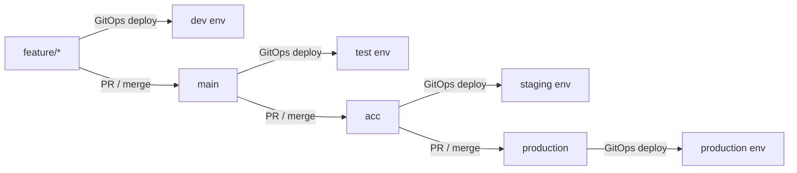
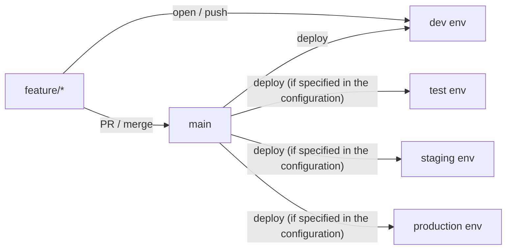

I've worked with different branching strategies:
[Trunk Based Development](https://trunkbaseddevelopment.com/),
[Gitflow](https://www.atlassian.com/git/tutorials/comparing-workflows/gitflow-workflow),
[GitHub Flow](https://docs.github.com/en/get-started/quickstart/github-flow), and mixes of these.

Each has its pros and cons. The best choice depends on your project.

In this post, I'll call it `Deployment Strategy`. Why? Because branching is just one part of how you deploy code. They go hand in hand.

## What is the pain?

I see many teams waste time on branch management. They wait too long for deployments. Git runners spin up slowly. Builds take forever.

**Developer Experience** matters a lot to me. I want developers to ship code fast, not wait around.

So yes, this post is opinionated. I favor speed and simplicity. If your project needs strict rules and compliance, this may not fit.

## GitOps Deployment Strategy

Let's keep it simple. Say we have **4 branches** and **4 environments**:
- `feature/*`: code deployed to **dev** environment
- `main`: code deployed to **test** environment
- `acc`: code deployed to **staging** environment
- `production`: code deployed to **production** environment

Here's the deployment flow:



### What are the pains?

- **Slow deployments**: Each deploy takes time. Developers wait a lot.
- **Too many branches**: Hard to manage. Easy to make mistakes.
- **Config mess**: Each environment needs different settings. That's tricky to handle.
- **No flexibility**: developers may not have the freedom to deploy code as needed, leading to delays and frustration.
- **All or nothing**: You can't deploy just one part (like only one DAG in Airflow). If you want to deploy to `staging`, you deploy everything in that branch.
  - Want to deploy just one piece? You need extra logic. More complexity.

### Example: Airflow DAG Deployment

Let's say we have an Airflow project. We want to deploy DAGs using GitOps.

Here's a typical repo structure:

```
airflow-dags-repo/
├── dags/
│   ├── dag1.py
│   ├── dag2.py
│   └── ...
├── requirements.txt
├── Dockerfile
└── ...
```

A DAG might look like this:

```python
PROJECT_ID = "project-{{ var.value.env_id }}-111"
REGION = "europe-west4"
JOB_NAME = "dbt"

default_args = {
    "owner": "airflow",
    "depends_on_past": False,
    "retries": 1,
}

with DAG(
    dag_id="dbt_consumer_jobs",
    default_args=default_args,
    ...
) as dag:
    ...
```

How does a developer deploy a new DAG?

1. Create a branch from `feature/*`
2. Make changes
3. Open a PR to `main`
4. Get it approved and merged
5. GitOps deploys to **test**

Same flow for **staging** and **production**. Merge up the chain.

Notice: we deploy the same code to all environments. We use [Airflow Variables](https://airflow.apache.org/docs/apache-airflow/stable/core-concepts/variables.html) to handle environment-specific settings in this example.


## Application Layer Deployment Strategy

Here's a different approach. We separate deployment from branching.

What does that mean? Let me show you with the same Airflow example.

### Same Airflow DAG Deployment Example

Same project. But now we define DAGs like this:

```python
env_config = get_environment_details()
dag: DAG | None = None

match env_config.environment_name:
    case Environment.DEV:
        logger.info("Creating DEV DAGs for %s", version_dev)

        dag = make_pipeline_dag(
            dag_id=f"{version_dev}_dag",
            interface_name=version_dev,
            dry_run=True,
            full_load=False,
            schedule_interval="30 18 * * *",
        )

    case Environment.TEST:
        logger.info("Creating TEST DAGs for %s", version_test)

        dag = make_pipeline_dag(
            dag_id=f"{version_test}_dag",
            interface_name=version_test,
            dry_run=False,
            full_load=False,
            schedule_interval="30 18 * * *",
        )

    case Environment.ACC:
        logger.info("Creating ACC DAGs for %s", version_acc)

        dag = make_pipeline_dag(
            dag_id=f"{version_acc}_dag",
            interface_name=version_acc,
            dry_run=False,
            full_load=False,
            schedule_interval="30 18 * * *",
        )

    case Environment.PROD:
        logger.info("Creating PROD DAGs for %s", version_prod)
        dag = make_pipeline_dag(
            dag_id=f"{version_prod}_dag",
            interface_name=version_prod,
            dry_run=False,
            full_load=False,
            schedule_interval="30 18 * * *",
            start_date=start_date_prod,
        )

    case _:
        logger.error(
            "Environment %s is not supported for %s pipeline.",
            env_config.environment_name,
            pipeline_name,
        )
```

In this setup, we only have one main branch: `main`.

When you merge a feature branch into `main`, code goes to all environments at once. Dev, test, staging, production. ONLY if the configuration is set in the application code.

### What are the benefits?

- **Fast**: All environments deploy at once. No waiting in line.
  - (This depends on how you set up your PR. But it can be fast.)
- **Simple branching**: Just one main branch. Less mess.
- **One source of truth**: All config lives in the code. Easy to see what's deployed where.



### What are the pains?

This fixes most GitOps problems. But it's not perfect:

- **Not for everyone**: Some projects can't use this. It depends on your setup & if your project allows it to have application layer deployment.
- **Dev environment conflicts**: If you have one dev environment and many developers, they might step on each other.
  - Fix: You can have multiple dev environments if project and team requirements allow.
  Or only deploy the changes; But ofcourse each comes with its own complexity.

## Conclusion

There's no perfect answer. Pick what fits your project.

Think about your team size. Think about how fast you need to ship. Think about how much risk you can take.

Then choose.
