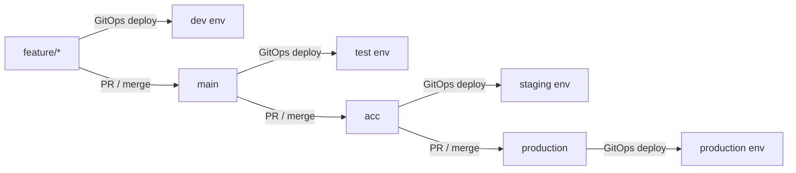
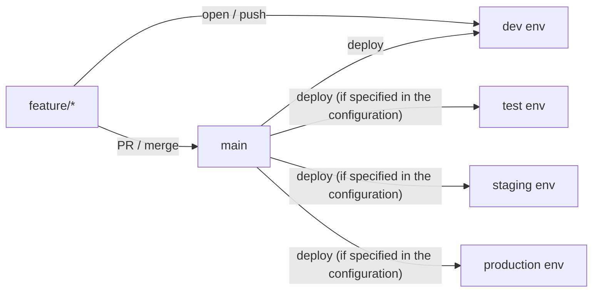

In different projects I have worked with different branching strategies, some famous ones like like
[Trunk Base Development](https://trunkbaseddevelopment.com/),
[Gitflow](https://www.atlassian.com/git/tutorials/comparing-workflows/gitflow-workflow),
[GitHub Flow](https://docs.github.com/en/get-started/quickstart/github-flow), a combination of both, ... 

Each of these strategies has its own pros and cons, and the choice of which one to use depends on the specific needs and requirements of the project.

For the sake of this post, let's call it `Deployment Strategy` as branching strategy is a subset of deployment strategy
and they are tightly coupled.

## What is the pain?

I see many teams on different projects are spending a lot of time on managing branches, spent long time for deployment and
waiting Git runners to spin up and deploy the artifacts. Also let me add that **Development Experience** is a key factor
for me and I want to decrease the lead time for developers as much as possible.

So expect this post to be opinionated toward improving developer experience and reducing lead time.
For projects needing high level of stability and compliance, this might not be the best approach.

## GitOps Deployment Strategy

Just to simplify the discussion, let's assume we have **3 main branches** in our repository
and 4 environments:
- `feature/*`: code deployed to **dev** environment
- `main`: code deployed to **test** environment
- `acc`: code deployed to **staging** environment
- `production`: code deployed to **production** environment

and we have the following deployment flow:



### What are the pains?

- Long lead time for developers: each deployment takes time and developers need to wait for the deployment to finish
- Complex branching strategy: managing multiple branches can be complex and error-prone
- Difficult to manage environment-specific configurations: managing different configurations for each environment can be challenging
- Lack of flexibility: developers may not have the freedom to deploy code as needed, leading to delays and frustration
- We can't deploy only specific part of the codebase, e.g., only DAGs in Airflow
  - If we want to do so, we need to have a separate logic for deploying only the part we want which adds more complexity

### Example: Airflow DAG Deployment 

Let's say we have an Airflow project and we want to deploy our DAGs using GitOps strategy.
We can have a Git repository with the following structure:

```
airflow-dags-repo/
├── dags/
│   ├── dag1.py
│   ├── dag2.py
│   └── ...
├── requirements.txt
├── Dockerfile
└── ...
```

And that's how a DAG will look like:

```python
PROJECT_ID = "project-{{ var.value.env_id }}-111"
REGION = "europe-west4"
JOB_NAME = "dbt"

default_args = {
    "owner": "airflow",
    "depends_on_past": False,
    "retries": 1,
}

with DAG(
    dag_id="dbt_consumer_jobs",
    default_args=default_args,
    ...
) as dag:
    ...
```

When a developer wants to deploy a new DAG or update an existing one, they would create a new branch
from `feature/*`, make their changes, and then create a pull request to merge their changes into the `main` branch.
Once the pull request is approved and merged, GitOps will automatically deploy the changes to the **test** environment.
The same process would be followed for promoting changes to **staging** and **production** environments.

So in this example, we are deploying this same code to different envs and we are relying on [Airflow Variables](https://airflow.apache.org/docs/apache-airflow/stable/core-concepts/variables.html)
to manage environment-specific configurations.


## Application Layer Deployment Strategy

In this strategy, we decouple the deployment process from the Git branching strategy.

Let's see what do I mean Application Layer Deployment Strategy by revisiting the previous example.

### Same Airflow Dag Deployment Example

Let's say we have the same Airflow project as before, but this time we have to define our dags like this:

```python
env_config = get_environment_details()
dag: DAG | None = None

match env_config.environment_name:
    case Environment.DEV:
        logger.info("Creating DEV DAGs for %s", version_dev)

        dag = make_pipeline_dag(
            dag_id=f"{version_dev}_dag",
            interface_name=version_dev,
            dry_run=True,
            full_load=False,
            schedule_interval="30 18 * * *",
        )

    case Environment.TEST:
        logger.info("Creating TEST DAGs for %s", version_test)

        dag = make_pipeline_dag(
            dag_id=f"{version_test}_dag",
            interface_name=version_test,
            dry_run=False,
            full_load=False,
            schedule_interval="30 18 * * *",
        )

    case Environment.ACC:
        logger.info("Creating ACC DAGs for %s", version_acc)

        dag = make_pipeline_dag(
            dag_id=f"{version_acc}_dag",
            interface_name=version_acc,
            dry_run=False,
            full_load=False,
            schedule_interval="30 18 * * *",
        )

    case Environment.PROD:
        logger.info("Creating PROD DAGs for %s", version_prod)
        dag = make_pipeline_dag(
            dag_id=f"{version_prod}_dag",
            interface_name=version_prod,
            dry_run=False,
            full_load=False,
            schedule_interval="30 18 * * *",
            start_date=start_date_prod,
        )

    case _:
        logger.error(
            "Environment %s is not supported for %s pipeline.",
            env_config.environment_name,
            pipeline_name,
        )
```

In this example, we only have one main branch (`main`) and as soon as a feature branch is merged into `main`,
the code is automatically deployed to all environments (**dev**, **test**, **staging**, and **production**)
depending on wheter the deployment to that environment is specified in the configuration.

### What are the benefits?

- Now deployment to all envs happen at the same time, so you don't need to wait for each deployment to finish individually and in sequence.
  - Yeah it depends whether you are defining all envs in same PR or not.
- Simpler branching strategy.
- Flexibility to change configurations for each environment in the code itself and in one single source of truth.
You can also check what is the latest state of deployed code easily.



### What are the pains?

Most of the things I mentioned in GitOps strategy are resolved here, but there are still some challenges:

- It may not be possible to have Application Layer strategy for all projects, it depends on the project requirements and constraints.
- If you only have 1 dev environment, it may be challenging to deploy multiple features at the same time without conflicts.
 - This is flexible and can be managed depending on how big the team is and project requirements. You can have multiple dev environments if needed
 or deploy only changed parts of the codebase.

Again, choosing the right deployment strategy depends on the specific needs and requirements of the project.
It's important to evaluate the pros and cons of each strategy and choose the one that best fits the project's goals and objectives.
