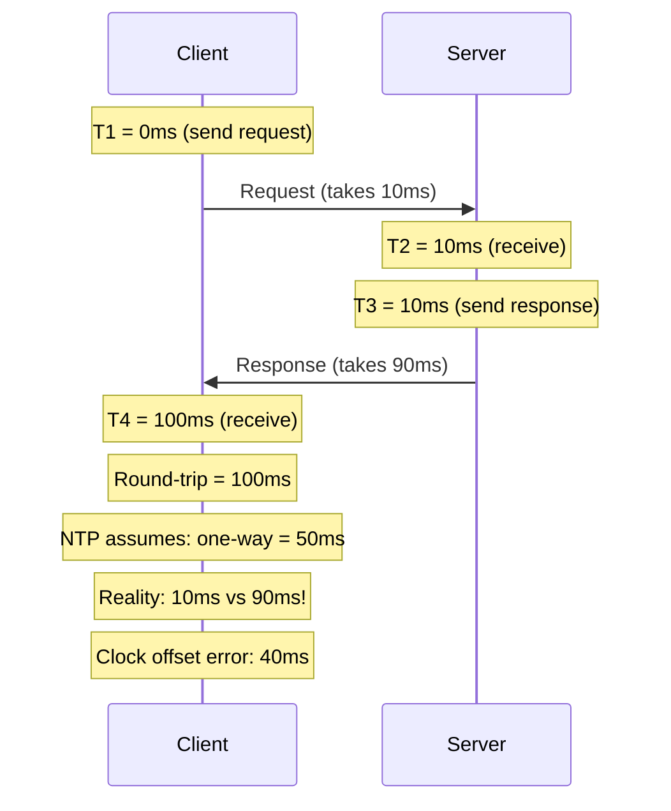
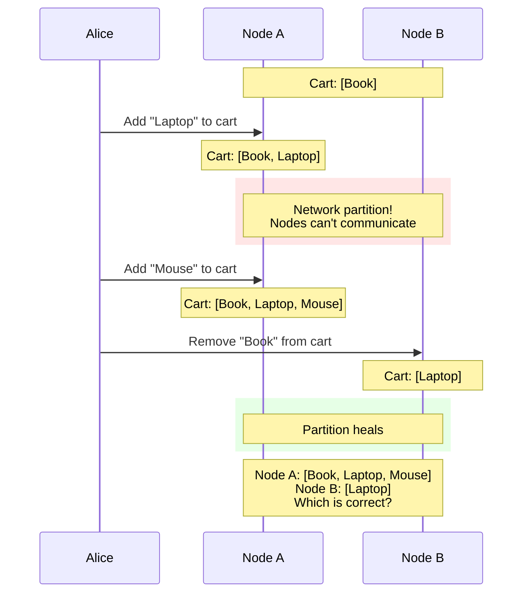

This blog post is here to encourage you to understand how [NTP](https://sookocheff.com/post/time/how-does-ntp-work/) works and why you shouldn't take time synchronization for granted in distributed systems.

In various distributed systems algorithms, you'll often see warnings against relying on NTP for time synchronization. One notable example is Martin Kleppmann's article on [How to do distributed locking](https://martin.kleppmann.com/2016/02/08/how-to-do-distributed-locking.html).

## The Ordering Problem

One of the biggest challenges in distributed systems is **ordering events** that happen on different nodes. Consider a distributed database where two nodes, A and B, both receive write requests:

- Node A receives: `SET x = 1` at time T1
- Node B receives: `SET x = 2` at time T2

Which write should win? If we can't accurately determine whether T1 came before T2, we can't maintain consistency. This is where time synchronization becomes critical—and where NTP falls short.

## What is NTP?

NTP (Network Time Protocol) is a widely used protocol for synchronizing clocks across computer systems over packet-switched networks. It can achieve synchronization within a few milliseconds over the public internet and sub-millisecond accuracy on local networks.

However, there are fundamental reasons why NTP can't provide the guarantees distributed systems algorithms require.

## Why NTP Falls Short

### 1. The Asymmetric Delay Problem

This is NTP's Achilles' heel. When a client synchronizes with an NTP server, it measures the round-trip time and **assumes** the network delay is symmetric (equal in both directions). But this assumption is often wrong.



NTP calculates: `offset = ((T2 - T1) + (T3 - T4)) / 2`

If the delays are asymmetric (which they often are due to routing, congestion, or queuing), NTP will miscalculate the clock offset. **There's no way for NTP to detect this error.**

### 2. Clock Drift

Even after synchronization, physical clocks drift due to hardware imperfections. Typical crystal oscillators [drift at 10-100 parts per million (ppm)](https://www.byte-lab.com/the-crystal-oscillator-design-basics-1-3/). At 100 ppm:
- 1 second of drift per ~3 hours
- ~30 seconds of drift per month

Between NTP synchronizations, clocks can diverge enough to cause ordering errors.

### 3. Clock Adjustments Can Break Monotonicity

When NTP detects a significant offset, it may:
- **Step** the clock: Jump time forward or **backward** instantly
- **Slew** the clock: Gradually speed up or slow down

Both can break assumptions your code makes:
- Time going backward breaks timeout calculations
- Slewing can make durations appear longer or shorter than reality

### 4. Bounded Error is Not Zero Error

Even in the best case, NTP provides synchronization within some error bound (milliseconds to tens of milliseconds). For distributed algorithms that need to reason about event ordering, **any** non-zero error is problematic.

If two events happen within the synchronization error window, we cannot determine their true order using physical timestamps alone.

## One Solution: Logical Clocks

Since we can't rely on physical time, distributed systems use **logical clocks**; Counters that track the *causal* ordering of events rather than wall-clock time.

### Lamport Clocks

Introduced by Leslie Lamport in 1978, Lamport clocks provide a simple way to order events:

**Rules:**
1. Each process maintains a counter `C`, initialized to 0
2. Before any event, increment `C`: `C = C + 1`
3. When sending a message, include the current `C` value
4. When receiving a message with timestamp `Cm`, update: `C = max(C, Cm) + 1`

**Key Property:** If event A *happened before* event B, then `C(A) < C(B)`

However, the converse is not true: if `C(A) < C(B)`, we cannot conclude that A happened before B. The events might be concurrent.

```
Node A:    [1] ----send----> [2] ----------------> [5]
                    |                                ^
                    v                                |
Node B:         [2] --> [3] --> [4] ----send-----> [4]
                                                    |
                         C = max(4, 4) + 1 = 5 -----+
```

### Vector Clocks

Vector clocks extend Lamport clocks to detect **concurrent** events that Lamport clocks cannot do.

**Rules:**
1. Each process `i` maintains a vector `V[1..N]` for N processes
2. Before any event at process `i`: `V[i] = V[i] + 1`
3. When sending, include the entire vector
4. When receiving vector `Vm` at process `i`:
   - For each `j`: `V[j] = max(V[j], Vm[j])`
   - Then: `V[i] = V[i] + 1`

**Key Properties:**
- A happened-before B: `V(A) < V(B)` (all components ≤, at least one <)
- A and B are concurrent: neither `V(A) < V(B)` nor `V(B) < V(A)`

Vector clocks let us detect conflicts in distributed systems (like Git detecting merge conflicts).

```
Node A:    [1,0] ----send----> [2,0] ----------------> [3,2]
                      |                                  ^
                      v                                  |
Node B:           [1,1] --> [1,2] ----send----------> [1,2]
                                                        |
                         V = max([2,0],[1,2]) + 1 ------+
                           = [2,2] + [1,0] = [3,2]
```

### Real-World Examples

These are some examples that I can think of where logical clocks are used in practice right now:

#### Raft Consensus: Term Numbers as Lamport Clocks

[Raft](https://raft.github.io/), the consensus algorithm used by etcd, Consul, and CockroachDB, uses **term numbers** that function as Lamport clocks:

- Each server maintains a monotonically increasing term number
- Terms increment when starting a new election
- When servers communicate, they update to the higher term
- Stale leaders (with lower terms) are immediately demoted

This allows Raft to detect obsolete information and prevent split-brain scenarios without relying on synchronized physical clocks.

#### Amazon Dynamo: Vector Clocks for Conflict Detection

[Amazon's Dynamo](https://www.allthingsdistributed.com/2007/10/amazons_dynamo.html), the system behind DynamoDB, uses **vector clocks** to detect conflicting writes.

**The Problem:** Imagine Alice's shopping cart is replicated across two nodes. A network partition occurs:



**Without vector clocks:** The system might use "last write wins" based on timestamps. But as we learned, clocks can be wrong. We might lose Alice's "Mouse" addition or accidentally restore the "Book" she deleted.

**With vector clocks:** Each node tracks its own write count. When the partition heals, the system sees:
- Node A's version: `[(A, 2)]` (2 writes on A)
- Node B's version: `[(B, 1)]` (1 write on B)

Neither version "happened before" the other; they're **concurrent**. Instead of guessing, Dynamo returns **both versions** to the application, which can merge them properly (keep Laptop and Mouse, remove Book).

## Conclusion

NTP is excellent for what it was designed for: keeping computer clocks reasonably synchronized with real-world time. But for distributed systems algorithms that require **formal guarantees** about event ordering, its inherent limitations make it unsuitable.

Logical clocks provide the foundation for reasoning about causality in distributed systems. Lamport clocks are simple and sufficient when you only need partial ordering. Vector clocks add the ability to detect concurrent events, which is essential for conflict detection and resolution.

The next time you design a distributed algorithm, remember: **physical time is unreliable, but causality is not.**

## Further Reading

- [Clock Synchronization Is a Nightmare](https://arpitbhayani.me/blogs/clock-sync-nightmare)
- [How does NTP work?](https://sookocheff.com/post/time/how-does-ntp-work/)
